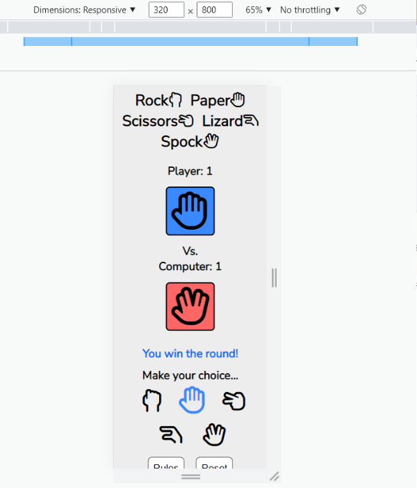

# **Rock Paper Scissors Lizard Spock**

## **Introduction**

Rock paper scissors lizard spock was first introduced to the world in The Big Bang Theory. 

It is a game of chance, just like to original rock paper scissors game, with some added variables.
The rules are very straight forward, as stated by Sheldon in the Big Bang Theory:
> "Scissors cuts paper, paper covers rock, rock crushes lizard, lizard poisons Spock, Spock smashes scissors, scissors > decapitates lizard, lizard eats paper, paper disproves Spock, Spock vaporizes rock, and as it always has, rock crushes scissors."
>

The game I have created takes the users input, determines a random selection for the computer and displays the selection of both player and computer and outputs the result of each round to the user.

The scores are displayed above the corresponding screen for player and computer.

The score is incremented after each win/loss.

The game will end when either the player or the computer reaches a score of 5.  

 

  

 

Live site can be found [HERE](https://james-fitz.github.io/rock-paper-scissors-lizard-spock/)  

## **Table of Contents**
- [**Rock Paper Scissors Lizard Spock**](#rock-paper-scissors-lizard-spock)
  - [**Introduction**](#introduction)
  - [**Table of Contents**](#table-of-contents)
  - [**Features**](#features)
  - [**UX**](#ux)
  - [**Wireframe**](#wireframe)
  - [**Testing**](#testing)
  - [**Technology Used**](#technology-used)
  - [**Deployment**](#deployment)
  - [**Credits**](#credits)

## **Features**    

I kept the features simple and straight forward for this project. 

Rules Modal

The rules modal is displayed as soon as the page is loaded. 

This ensures that the user will be presented with the rules immediately and will understand how the game works.

  

Header

A simple header with icons corresponding to the relevent choices available in the game.

  

Gameplay Screen

This is the main gameplay area.  
The players choice icon is displayed in the blue box.  
The computers choice icon is displayed in the red box.  
The scores are displayed above the colored boxes. 

 

Round Results Area

The function to display the result is on a 200ms delay to simulate a more realistic rock paper scissors game.  
There are four different options that can be displayed in the round results area.  

- "Waiting for input" is the default string that is displayed.
- "Computer wins the round!" is displayed when the computer wins a round.
- "You win the round!" is displayed when the player wins a round.
- "Draw!" is displayed when the computer and player make the same choice.

  

 

There is also a 150ms delay on the functions to display the icons that were chosen by the user and computer. This was done to simulate a more realistic game, rather than instantaneous choices being made and displayed.  

When the player wins, the win round message is displayed and the players score is increased by one.  
  

 

When the computer wins, the computer wins message is displayed and the computers score is increased by one.  
  

 

When there is a draw result, the draw message is displayed and neither scores are increased.  
  

 

Player Choice Icons

There are five choices that the player can make. Each icon will increase in size and change to blue when the player hovers over it.

  

Extra Buttons

There are two buttons underneath the gameplay area.

- The rules button will display a modal pop up with the rules for the game.
- The reset button will reset all of the gameplay area to it's default values.

  

Results Modals

- This modal pop up is displayed when the user reaches five round wins and wins the game.  
  

 

- This modal pop up is displayed when the computer reaches five round wins and wins the game.  
  

  

Future Features
  

- Implementation of a landing page in a future version, which contains the rules and a start game button which navigates the user to the gameplay page.  
- Implementation of a scored tracking system that will keep track of the overall ammount of games that the player and computer have won.  

  

## **UX**    

I wanted to utilize a very simple, clear UX for this project. 
The page opens up on the rules modal which clearly states the rules for the player.  

Color Palette
  

I chose very simple colors for this project to ensure the design was simple, clear and easy for the user to differentiate between player/computer, and win/loss.  
  

  

Font
  

I chose a clean, simple font to maximise readability and ensure a positive user experience.  
   

   

## **Wireframe**    

I kept the wireframe design simple as I wanted this project to be clear, to the point and simple to understand/read.  
The wireframe design is very similar to the finished project.  

Opening Home Page
  

- Opening home page  
  

  

Game Screen
  

- Game Screen  
  

  

Win Screen
  

- Win screen  
  

  

Mobile View
  

- Mobile view  
  

  

## **Testing**  

Responsiveness
  

The application has been tested on multiple devices and at multiple screen width to ensure responsive design at all levels.
Media queries were used at lower screen widths to ensure the application stays responsive.
The display icon boxes were moved to a vertical stack to ensure they can still be viewed at lower screen width.

- Responsiveness of ipad mini screen  
  

- Responsiveness of 320px screen width  
  

  

Console Testing
  

No errors occur in the console while the game is being played.  
All buttons were tested and all are working as intended.  

  

Validator Testing
   

HTML Validator Result    
  

  

CSS Validator Result  
    

 

Javascript Validator Results  
  

  

Lighthouse Testing
  

Lighthouse Result  
  

  

Known Bugs and Errors
  

No known bugs or errors in this project  

  

## **Technology Used**   

Programs Used
  

  

Languages Used
  

- HTML5
- CSS
- Javascript
  

  

## **Deployment**  

Github Pages
  

  

How to Clone
  

  

How to Fork
  

  

How to Make Local Clone
  

  

## **Credits**  

Media
  

- Favicon image from [Freepik](https://www.flaticon.com/free-icon/rock-paper-scissors_6729743?term=rock%20paper%20scissors&page=1&position=15&page=1&position=15&related_id=6729743&origin=tag)  

- Rules image taken from [Big Bang Theory Wiki page](https://bigbangtheory.fandom.com/wiki/Rock,_Paper,_Scissors,_Lizard,_Spock)  

- Icons taken from [FontAwesome](https://fontawesome.com/)  

  

Code
  

- [W3Schools](https://www.w3schools.com/) - Used to learn about modals and extra features for JS functions.  

- Help with code from Slack, tutor support and mentor Chris Quinn.  

  